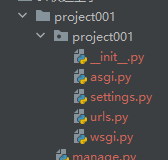

## 快速上手 
 
1. 安装  
```shell
 pip install django
```    

- 安装之后Scripts里头会多一个django-admin.exe  

2. 常用命令
``` 
cd 指定目录
django-admin startproject 项目名  
还有一种
django-admin startproject 项目名称 .   《==表示把项目创建到当前目录下
```



```  
manage.py是项目的管理工具    
awsgi 是异步的django  
wsgi 是同步的django 线上部署的时候会换成uwsgi  
urls是主路由，编写url和函数的对应关系    
settings放的是配置项目文件,这里头并不是全部的,只是一部分

```

3.初体验   
在urls.py中这么写 
- ```python
    from django.contrib import admin
    from django.urls import path
    from django.shortcuts import HttpResponse #tips :跟爬虫中对上了！！！
    
    def info(request):
        print("被调用咯!!")
        return HttpResponse("hello django") #django是需要将数据封装成对象的
    def user(request):
        print('用户中心')
        return HttpResponse('用户中心')
    
    urlpatterns = [
        # path('admin/', admin.site.urls),
        path('api/index/', info),  # 前面是路由，后面是路由绑定的函数
        path('api/usercenter/',user)
    ]     
  ```  

然后用manage.py来运行  
- ```bash 
    python manage.py runserver  
    当然，也可以自己指定 
    python manage.py runserver 127.0.0.1:8099 
    和fastapi，flask一样,都可以 ctrl+c结束运行
   ```  

关于如何创建app
```bash 
    python manage.py startapp app的名字
   ```   

## 小结常用命令    
```shell
django-admin startproject 项目名  
python manage.py startapp app名  
python manage.py runserver 
```
## 虚拟环境创建  
- venv  
- ```cd xxx/xxx/project
     python3.11 -m venv envname
     python3.14 -m venv envname
     python3.11 -m venv d:/xxx/xxx/envname
   ```  
  
- virtualenv
- ``` 
  pip install virtualenv 
  
  cd /xxx/xx/
  virtualenv envname --python=python3.14
  
  virtualenv /xxx/xx/envname --python=python3.14
  
  
  win版本 
  创建
  cd d:/envs
  virtualenv envname --python=python3.11
  
  激活
  activate
  
  关闭
  deactivate
  
  ```
- virtualenvwrapper-win
- ```  
  pip install virtualenvwrapper-win
  
  mkdirvirtualenv envname
  
  workon envname
  
     ```