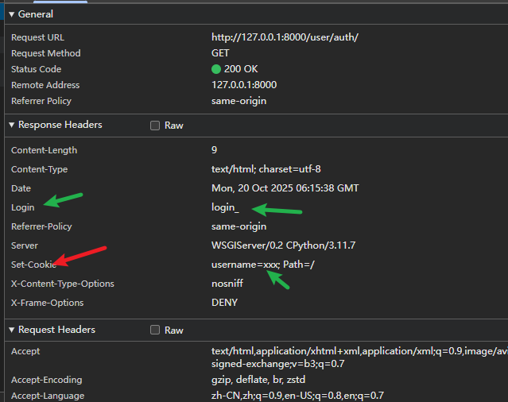

# 重定向,返回值，响应头...

## 重定向 
这个和flask中的别无二致,注意重定向在web中是将重定向路由给用户,然后用户根据重定向中的信息再次对新的路由进行访问  

```python
return redirect('/auth')
```


## 返回值  

1. 渲染 render  
例如:
 ```python
renturn render(request,'login.html')
```
它会默认去settings中指定的templates的文件夹下去寻找
```python
TEMPLATES = [
    {
        'BACKEND': 'django.template.backends.django.DjangoTemplates',
        'DIRS': [BASE_DIR / 'templates'],
        'APP_DIRS': True,
        'OPTIONS': {
            'context_processors': [
                'django.template.context_processors.debug',
                'django.template.context_processors.request',
                'django.contrib.auth.context_processors.auth',
                'django.contrib.messages.context_processors.messages',
            ],
        },
    },
]
```
其中`'DIRS'`就是我们指定的templatedir的位置  
`BASE_DIR` 会自动定位当前的文件的所在位置,然后后面指定的是我们在项目根目录创建的模板文件的文件夹  

如果没有找到,那么Django将自动去我们注册的app中寻找有没有templates目录,如果有则使用  

多应用的时候最好是在templates再嵌套

## 响应头  
响应头的设置 
```python

res = HTTPResponse('login')
res['指定键']='指定值'
return  res  

#其实学了这个发现和flask的处理方式还是十分相似的 
#flask中的设置 
res = make_response【或者用Respose】(return render_templates('login.html'))
res.headers['指定键'] ='指定值'
res.set_cookie('key','value',max_age)
```

其实flask和django中的set_cookie()的功能以及参数都是一样的

实例代码如下 
```python
def auth(request):
    res = HttpResponse('你好!!!')
    res.headers['login'] = 'login_'
    res.set_cookie('username', 'xxx')
    return res
```


