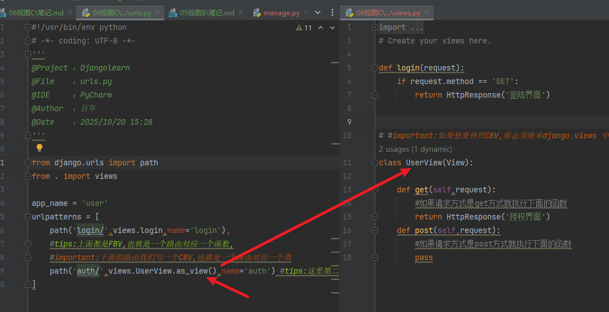

## fbv和cbv 
- FBV,视图用函数的形式编写(目前先用这个)
- CBV,视图用类的形式编写  (之后做前后端分离主要用这个)


### FBV案例
```python
from django.urls import path
from . import views

app_name = 'user'
urlpatterns = [
    path('user/',views.login,name='login'),
    #tips:上面都是FBV,也就是一个路由对应一个函数,
    

]
```

### CBV案例
```python
from django.urls import path
from . import views

app_name = 'user'
urlpatterns = [
    path('login/',views.login,name='login'),
    #tips:上面都是FBV,也就是一个路由对应一个函数,
    #important:下面的路由我们写一个CBV,也就是一个路由对应一个类
    path('auth/',views.UserView.as_view(),name='auth') #tips:这里第二个参数指定我们的类名,并在后头加上.as_view,这是规定
]
```


### 在views.py中 
比起fbv中需要自己手动处理请求方式的判断,CBV好就好在它可以自动匹配请求方式
```python

from django.shortcuts import render,HttpResponse
from django.views import View
# Create your views here.

def login(request):
    return HttpResponse('登陆界面')
    if request.method == 'POST':
        name=request.POST.get('uname')
        pwd = request.POST.get('pwd')
        if name and pwd:
            return HttpResponse('登陆成功')


#important:如果想要使用CBV,就必须继承django.views 中的View
class UserView(View):

    def get(self,request):
        #如果请求方式是get方式就执行下面的函数
        pass
    def post(self,request):
        #如果请求方式是post方式就执行下面的函数
        pass
```




其实它们本质上一模一样，fbv的话类似于path('xxx',views.func[也就是接收一个函数],name='xxx')  
cbv 则是path('xxx',views.类.as_view(),name='xxx')   
这个as_view()可以将集成自View的类转化为函数,所以本质都是视图函数