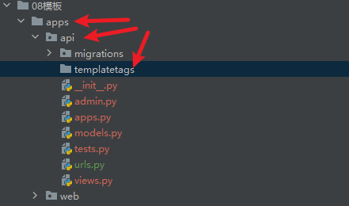
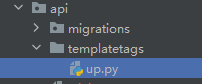

## 模版  


### 模板的寻找方式  
可以利用在setting.py中设置模板路径的方式来设置模板  
```python
TEMPLATES = [
    {
        'BACKEND': 'django.template.backends.django.DjangoTemplates',
        'DIRS': [BASE_DIR/'templates'],
        'APP_DIRS': True,
        'OPTIONS': {
            'context_processors': [
                'django.template.context_processors.debug',
                'django.template.context_processors.request',
                # 'django.contrib.auth.context_processors.auth',
                # 'django.contrib.messages.context_processors.messages',
            ],
        },
    },
]

```

最开始就是从指定的模版文件去找,也就是`'DIRS': [BASE_DIR/'templates']` 
但是如果找不到的话就去已经注册的app里去寻找   


- 如果是简单的项目的话就让模版放在根目录   
- 如果是多app的操作的话就放在各自的app中,公共部分放在根目录的templates中

### 研究一下返回模版html的细节  
```python

def index(request):
    if request.method == 'GET':
        a1 = '你好'
    #1.打开api/index.html 文件,读取内容 
    #2.渲染完成,得到一个渲染完成的字符串
    #3.将文本返回给浏览器
        return render(request,'api/index.html', {'a1':a1}) 

```  

其实本质和flask很像,但是django返回的时候得指定是一个字典才行
其实更推荐如下写法  
```python
def index(request):
    if request.method == 'GET':
        context = {
            'a1':'xxx',
            'a2':'yyy',
            'a3':'zzz',
            'a4':'vvv'
        }
        return render(request,'api/index.html', context) 

```
这样的话代码更明晰


### Django 常用的模板语法  
- 其实和flask中的语法真的是差不多的 


- 列表
在django的模板语法里不支持通过python列表中的list[0]这种的索引  
但是支持.索引  
如
```html
<p>{{lst.0}}</p>
<p>{{lst.1}}</p>
<p>{{lst.2}}</p>

<div>
        
            <li>{{ i }}</li>
        
    </div>
```

- 字典  

字典可以利用
> .tiems获取键值对  
> .keys  获取键  
> .values 获取值
> 

这里和flask的jinja语法略有不同  
这里的是不需要在后边加上括号的,但是flask的jinja2则需要


- 还有比较常用的列表套字典(现代网页构建多利用此写法加载信息)

```python
from django.shortcuts import render

# Create your views here.

def index(request):
    if request.method == 'GET':
        a1 = '你好'
        lst=[i for i in range(10)]
        dic={
            'name':'jakson',
            'age':24,
            'gender':'male',
            'address':'queen_s'
        }
        infodic_lst=[
            {
                'name': 'fjaafeson',
                'age': 24,
                'gender': 'mfeale',
                'address': 'afqaefen_s'
            },
            {
                'name': 'zdfson',
                'age': 21,
                'gender': 'male',
                'address': 'queen_s'
            },
            {
                'name': 'dxfzvaefon',
                'age': 23,
                'gender': 'female',
                'address': 'aauaedfan_s'
            },
            {
                'name': 'aaaw1son',
                'age': 21,
                'gender': 'male',
                'address': 'qfn_s'
            },
            {
                'name': 'jakson',
                'age': 22,
                'gender': 'female',
                'address': 'qefn_s'
            }
        ]
        content={
            'a1':a1,
            'lst':lst,
            'dic':dic,
            'infodic_lst':infodic_lst,
        }

        return render(request,'api/index.html', content)

```
```html
<div style="background-color: orange;color: white;text-align: center">
    <table>
        <thead>
            <tr>
                
                    <td>{{ k }}</td>
                
            </tr>
        </thead>
        <tbody>
            
                <tr>
                    
                        <td>{{ v }}</td>
                    
                </tr>
            
        </tbody>
    </table>

</div>
```

- 也可以传一个对象
```python
from django.shortcuts import render

# Create your views here.
class Stu(object):
    def __init__(self,name,age,gender,address):
        self.name = name
        self.age =age
        self.gender = gender
        self.address = address
def index(request):
    if request.method == 'GET':
        a1 = '你好'
        lst=[i for i in range(10)]
        dic={
            'name':'jakson',
            'age':24,
            'gender':'male',
            'address':'queen_s'
        }
        infodic_lst=[
            {
                'name': 'fjaafeson',
                'age': 24,
                'gender': 'mfeale',
                'address': 'afqaefen_s'
            },
            {
                'name': 'zdfson',
                'age': 21,
                'gender': 'male',
                'address': 'queen_s'
            },
            {
                'name': 'dxfzvaefon',
                'age': 23,
                'gender': 'female',
                'address': 'aauaedfan_s'
            },
            {
                'name': 'aaaw1son',
                'age': 21,
                'gender': 'male',
                'address': 'qfn_s'
            },
            {
                'name': 'jakson',
                'age': 22,
                'gender': 'female',
                'address': 'qefn_s'
            }
        ]
        content={
            'a1':a1,
            'lst':lst,
            'dic':dic,
            'infodic_lst':infodic_lst,
            'obj':Stu('nikofox',28,'male','hawaii')
        }

        return render(request,'api/index.html', content)

```

```html

<tr>
    <td>{{ obj.name }}</td>
    <td>{{ obj.age }}</td>
    <td>{{ obj.gender }}</td>
    <td>{{ obj.address }}</td>
</tr>
```

- 传入一个函数  
```python
def fetch_data():
    return '我是一个函数,我被调用执行了'
```
```html
<div>
    {{ func }}
</div>
```

这样就会执行这个函数!!


- 传入一个生成器对象/生成器函数  
```python
def gen_r():
    yield 111
    yield 222
    yield 333
def index(request):
    if request.method == 'GET':
        a1 = '你好'
        lst=[i for i in range(10)]
        dic={
            'name':'jakson',
            'age':24,
            'gender':'male',
            'address':'queen_s'
        }
        infodic_lst=[
            {
                'name': 'fjaafeson',
                'age': 24,
                'gender': 'mfeale',
                'address': 'afqaefen_s'
            },
            {
                'name': 'zdfson',
                'age': 21,
                'gender': 'male',
                'address': 'queen_s'
            },
            {
                'name': 'dxfzvaefon',
                'age': 23,
                'gender': 'female',
                'address': 'aauaedfan_s'
            },
            {
                'name': 'aaaw1son',
                'age': 21,
                'gender': 'male',
                'address': 'qfn_s'
            },
            {
                'name': 'jakson',
                'age': 22,
                'gender': 'female',
                'address': 'qefn_s'
            }
        ]

        content={
            'a1':a1,
            'lst':lst,
            'dic':dic,
            'infodic_lst':infodic_lst,
            'obj':Stu('nikofox',28,'male','hawaii'),
            'func':fetch_data,
            'gen_er_obj':gen_r(),#这样传入的就是一个生成器对象
            'gen_er_func':gen_r, #这样传入的就是一个生成器函数
        }

        return render(request,'api/index.html', content)

```
可以传入一个生成器,然后模版其实默认是给函数加了括号,相当于
```html
    <ul>
        
            <li>{{ f }}</li>
        
    </ul>
```

### 内置模板函数
在Django模版语法中提供了内置函数让我们来方便对数据进行展示操作    
其实很多和学习flask的Jinja2的差不多 

{|xxx} <------写法

| 名称                  | 功能         |  
|:--------------------|------------| 
| upper               | 将字母大写      |  
| lower               | 小写         |
| safe                | 原样输出       |
| date                | 处理时间对象     |
| date:"Y-m-d H:i:s"  | 给时间加上格式并返回 |


### 自定义模版函数(和flask中有些差异)


在app里面创建一个文件夹叫做templatetags(注意,必须是这个名字)



在其中创建一个文件，注意避开保留字段



其中这么写 
```python
from django import template

register = template.Library()

@register.filter
def upw(value):
    return value.upper()
```

写好之后在自己的html中加载
```html

<!DOCTYPE html>
<html lang="en">
<head>.......
<div>
    {{ 'a' | upw }}
</div>
</body>
</html>
```
这个功能实现了让字母大写,也可以自己写出别的其它的功能


### @register.simple_tag  
普通的@register.filter在实现传参的时候参数的数量是有限制的,只能传一个,但是simpletag可以传入任意个参数 
```python
@register.simple_tag
def mytag():
    return 'aloha'  #不传入参数的话就单独使用即可


@register.simple_tag
def mytag2(a1:str,a2:str):
    return a1+'hihih'+a2
```
模版的写法和之前普通的filter是有区别的，之前普通的filter都是写双花括号里面而这个则是写入到``里面
```html
<div>
    
</div>

<div></div>  
```


### @register.inclusion_tag()

inclusion_tag('html文件路径')可以将内容放到一个html文件当中然后在别的html文件中加载  
```python
@register.inclusion_tag('api/demo.html')
def mytag3():
    return {'name':'张三','age':20}
```

api/demo.html
```html
<p>{{ name }} --- {{ age }}</p>
```

index.html
```html
<html>
....
....
<div></div>


<p></p>
</body>
</html>
```

这样的效果其实就是这样的

```html
<html>
....
....
<div></div>


<p>{{ name }} --- {{ age }}</p>
</body>
</html>
```

非常的好用，它也是可以加参数的，这里不多展开


### 三种方式对比  
- filter
> 数据处理，参数1-2个  
> 数据处理，if条件  

- simple_tag
> 参数无限制 & 返回文本  

- inclusion_tag()
> 参数无限制 & html 片段 

一个实际的需求(利用inclusion_tag())
根据权限不同设置不一样的顶部菜单  


## 模版继承  
其实和flask的也是差不多的,都是  


还有
 
大部分都是一样的     


一般来说,base.html还是像flask当中的一样放在templates的目录下  


## 模版的include  
譬如api下有一个plg.html
```html
<h1>我是一个小组件</h1>
```

然后在index.html中导入它  
```html
<html>
......
......
<div></div>


<p></p>


</body>
</html>
```