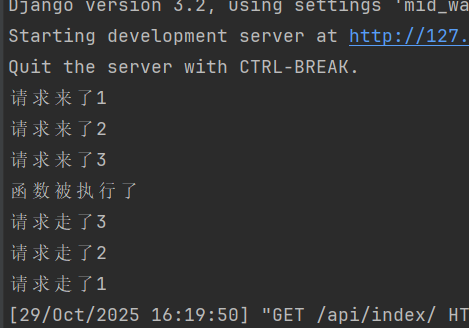
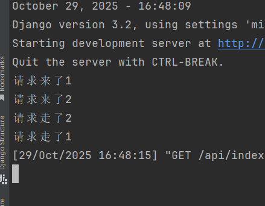
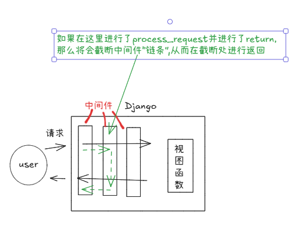
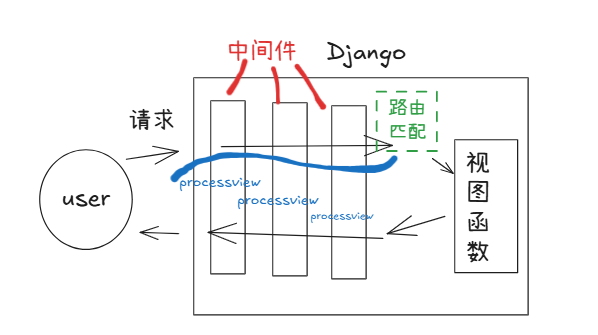
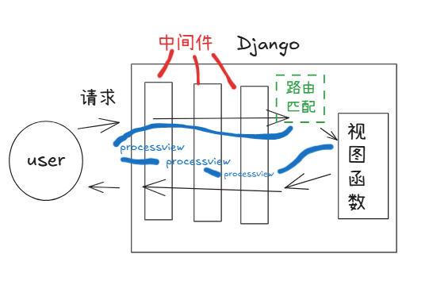
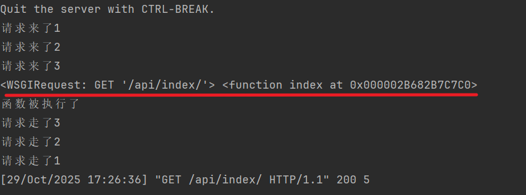
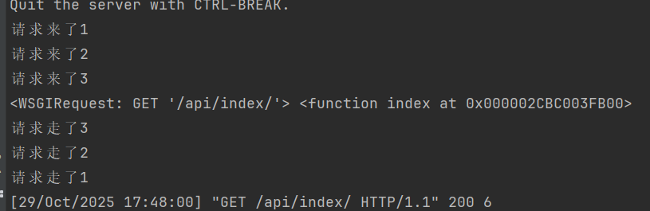

## 中间件  
   

>它可以实现类似于flask中before_request&after_request的功能  
定义每个视图函数在被访问前以及访问完成后的一些操作   

中间件可以用类实现也可用函数实现,但一般使用类来实现  
- middlewares/md.py
```python
class MyMD(object):

    def __init__(self,get_response):
        self.get_response = get_response


    def __call__(self, request):

        # tips:请求进来的时候走的是这里
        print('请求来了')
        response = self.get_response(request)  #tips:这一步其实就是执行视图函数
        # tips:请求从这里再出去
        print('请求处理完成了')
        return response
```
- views.py  
```python
def index(request):
    print('函数被执行了')
    return HttpResponse("hello")

```
- 注册中间件 (settings.py中注册它)
```python
MIDDLEWARE = [
    .......
    'django.middleware.clickjacking.XFrameOptionsMiddleware',
    'middlewares.md.MyMD' #important:将我们写好的中间件注册进来
]
```

#### 三步走
- 定义类
- 定义方法
- 注册

-------
以上的是原始方式写法


接下来是常用的写法   
学习的时候我发现有点像之前学习scrapy的时候学的middle_ware的配置  


```python
class MyMD(object):

    def __init__(self,get_response):
        self.get_response = get_response


    def __call__(self, request):
        #另外一种写法
        if hasattr(self, 'process_request'):
           self.process_request(request)
        response = self.get_response(request)
        if hasattr(self, 'process_response'):
            self.process_response(request, response)
        return response
    def  process_request(self, request):
        print('请求来了')
    def process_response(self, request, response):
        print('请求处理完成了')
```
如果有返回值的话，可以将返回值处理一下
```python

        if hasattr(self, 'process_request'):
            response = self.process_request(request)
        response = response or self.get_response(request)
        if hasattr(self, 'process_response'):
            response = self.process_response(request, response)
        return response
```


### 所以！！！！！为了方便我们直接使用,可以选择走继承`MiddlewareMixin  ` 
```python
from django.utils.deprecation import MiddlewareMixin

class MyMD(MiddlewareMixin):
    def  process_request(self, request):
        print('请求来了')
    def process_response(self, request, response):
        print('请求处理完成了')
        return response  #important:注意一定要加上返回值,这一点也有些像scrapy中间件中的传递一样,必须有返回值

```
这样就极其方便了!!!!


### 详细了解process_request和process_response

定义多个中间件  
```python
from django.utils.deprecation import MiddlewareMixin
# important:最优解,继承MiddlewareMixin
class MyMD(MiddlewareMixin):
    def process_request(self, request):
        print('请求来了1')

    def process_response(self, request, response):
        print('请求走了1')
        return response  #important:注意一定要加上返回值,这一点也有些像scrapy中间件中的传递一样,必须有返回值


class MyMD2(MiddlewareMixin):
    def process_request(self, request):
        print('请求来了2')

    def process_response(self, request, response):
        print('请求走了2')
        return response


class MyMD3(MiddlewareMixin):
    def process_request(self, request):
        print('请求来了3')

    def process_response(self, request, response):
        print('请求走了3')
        return response
```

然后在settings.py中注册中间件
```python
    'middlewares.md.MyMD', #important:将我们写好的中间件注册进来
    'middlewares.md.MyMD2',
    'middlewares.md.MyMD3',
```

>最后访问可以得到这样的结果  
   


正常情况下都是这样的,因为process_request被调用但是process_request并没有返回值  

但是如何终止而不是所有的中间件都走一遍呢?那就是给某个需要返回值的中间件加上返回值，之后它就直接返回,后续的中间件也不再返回 


例如我们在MyMD2对request进行处理
```python
class MyMD2(MiddlewareMixin):
    def process_request(self, request):
        print('请求来了2')
        return HttpResponse('myMD2对请求进行了处理并触发')

    def process_response(self, request, response):
        print('请求走了2')
        return response


```


>这样它在process_request之后发现直接就得返回了(譬如这里写的是HttpResponse),那就对其进行返回  
如果发起请求结果就像下面这样    


>图解process_request被指定返回对象后的后续步骤  


- 应用场景:判断用户权限,黑名单拦截   


### process_view方法
>所有请求在到达视图函数之前会经过路由匹配,  
但路由匹配结束后并非直接将数据交给视图函数，而是回到中间件开始处  
执行process_view方法  



>之后等所有的process_view执行完了之后才真正执行视图函数  

>


例如  
```python
from django.utils.deprecation import MiddlewareMixin
class MyMD2(MiddlewareMixin):
    def process_request(self, request):
        print('请求来了2')
        # return HttpResponse('myMD2对请求进行了处理并触发')

    def process_view(self, request, view_func, view_args,
                     view_kwargs):  # view_func 路由匹配成功之后的视图函数,也就是说如果匹配成功那就执行指定的这个view_func视图函数
        print(request, view_func)

    def process_response(self, request, response):
        print('请求走了2')
        return response
```

> 结果  

> 

如果某些请求都需要做前置操作的那就用process_request,  
而如果根据请求的视图函数做操作的时候那就使用process_view  

简单讲:做任何操作前都先判断是否登陆或获取该登陆用户的IP(那就用process_request)
一个用户登录后判断该用户的身份来展示他的个人界面(用process_view)
譬如用户和管理员虽然访问的都是登陆界面但是用process_view来判定该人身份来决定该给此人返回哪个页面    


## 注意  
process_view也是可以有返回值的,但是和process_request原路返回不同的是  
`process_view会走完所有中间件然后返回`  
这里还是仅修改MyMD2为例
```python
class MyMD2(MiddlewareMixin):
    def process_request(self, request):
        print('请求来了2')
        # return HttpResponse('myMD2对请求进行了处理并触发')

    def process_view(self, request, view_func, view_args,
                     view_kwargs):  # view_func 路由匹配成功之后的视图函数,也就是说如果匹配成功那就执行指定的这个view_func视图函数
        print(request, view_func)
        return HttpResponse('返回')

    def process_response(self, request, response):
        print('请求走了2')
        return response
```

>结果是这样  

> 

与process_request做返回对比,process_view走完了全部中间件之后才返回  
而process_request是如果返回则后方不执行