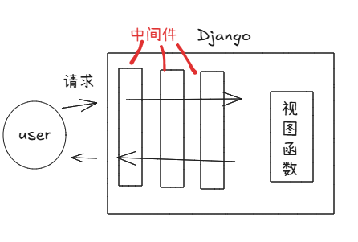
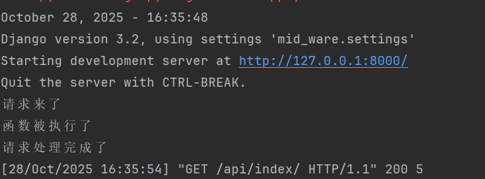

## 中间件  
   

>它可以实现类似于flask中before_request&after_request的功能  
定义每个视图函数在被访问前以及访问完成后的一些操作   

中间件可以用类实现也可用函数实现,但一般使用类来实现  
- middlewares/md.py
```python
class MyMD(object):

    def __init__(self,get_response):
        self.get_response = get_response


    def __call__(self, request):

        # tips:请求进来的时候走的是这里
        print('请求来了')
        response = self.get_response(request)  #tips:这一步其实就是执行视图函数
        # tips:请求从这里再出去
        print('请求处理完成了')
        return response
```
- views.py  
```python
def index(request):
    print('函数被执行了')
    return HttpResponse("hello")

```
- 注册中间件 (settings.py中注册它)
```python
MIDDLEWARE = [
    .......
    'django.middleware.clickjacking.XFrameOptionsMiddleware',
    'middlewares.md.MyMD' #important:将我们写好的中间件注册进来
]
```

#### 三步走
- 定义类
- 定义方法
- 注册

-------
以上的是原始方式写法


接下来是常用的写法   
学习的时候我发现有点像之前学习scrapy的时候学的middle_ware的配置  


