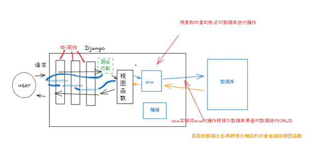
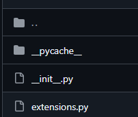

## ORM(对象模型映射)

> 和之前在flask学习orm的性质和本质其实是差不多的,
> 也要学习关于一对一,一对多,多对多的关系,只是flask中的语法和django中的语法略有不同   



### orm创建表  
> 这里不妨回忆一下flask，自己之前要使用mtv模型的时候是这么做的   
> 
> 
> 然后在exts里头这样定义
> 
```python
"""
@File    :extensions.py
@Editor  : 百年
@Date    :2025/8/10 8:56 
"""
from flask_migrate import Migrate
from flask_sqlalchemy import SQLAlchemy

db = SQLAlchemy()
migrate = Migrate()
```

之后在app的model.py中这样写  
```python
from exts.extensions import db
from datetime import datetime


class User(db.Model):
    __tablename__ = 'user'
    id = db.Column(db.Integer, primary_key=True, autoincrement=True)
    username = db.Column(db.String(20), nullable=False)
    password = db.Column(db.String(128), nullable=False)  # 要放的是要加密的密码,所以大小应当是加密之后的大小,故db.String(Size) 的Size要谨慎设置
    phone = db.Column(db.String(11), unique=True, nullable=False)
    email = db.Column(db.String(30))
    icon = db.Column(db.String(100))
    regi_date = db.Column(db.DateTime, default=datetime.now)
    isdelete = db.Column(db.Boolean, default=False)  # 逻辑删除
    # start_cb:增减一个字段,不会在数据库中出现,用于链接字段,relationship是在view和templates中体现的
    articles = db.relationship('Article', backref='user', lazy='select')
    photo = db.relationship('Photo', backref='user')
    comment=db.relationship('Comment',backref='user')
    selfintro = db.Relationship('Aboutme',backref='user')
    # end_cb 需要注意它是模板层面的,所以不需要再做迁移操作
    def __str__(self):
        return self.username
```

但是Django直接继承了orm  
