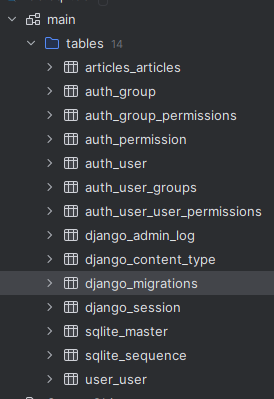

## ORM(对象模型映射)

> 和之前在flask学习orm的性质和本质其实是差不多的,
> 也要学习关于一对一,一对多,多对多的关系,只是flask中的语法和django中的语法略有不同   


### orm创建表  
> 这里不妨回忆一下flask，自己之前要使用mtv模型的时候是这么做的   
> 
> 
> 然后在exts里头这样定义
> 
```python
"""
@File    :extensions.py
@Editor  : 百年
@Date    :2025/8/10 8:56 
"""
from flask_migrate import Migrate
from flask_sqlalchemy import SQLAlchemy

db = SQLAlchemy()
migrate = Migrate()
```

之后在app的model.py中这样写  
```python
from exts.extensions import db
from datetime import datetime


class User(db.Model):
    __tablename__ = 'user'
    id = db.Column(db.Integer, primary_key=True, autoincrement=True)
    username = db.Column(db.String(20), nullable=False)
    password = db.Column(db.String(128), nullable=False)  # 要放的是要加密的密码,所以大小应当是加密之后的大小,故db.String(Size) 的Size要谨慎设置
    phone = db.Column(db.String(11), unique=True, nullable=False)
    email = db.Column(db.String(30))
    icon = db.Column(db.String(100))
    regi_date = db.Column(db.DateTime, default=datetime.now)
    isdelete = db.Column(db.Boolean, default=False)  # 逻辑删除
    # start_cb:增减一个字段,不会在数据库中出现,用于链接字段,relationship是在view和templates中体现的
    articles = db.relationship('Article', backref='user', lazy='select')
    photo = db.relationship('Photo', backref='user')
    comment=db.relationship('Comment',backref='user')
    selfintro = db.Relationship('Aboutme',backref='user')
    # end_cb 需要注意它是模板层面的,所以不需要再做迁移操作
    def __str__(self):
        return self.username
```

但是Django直接继承了orm  

我们只需要在app的models.py中按照规则进行编写就可以了   

类似于这样  
```python
from django.db import models
class User(models.Model):
    name = models.CharField(max_length=16)
    age = models.IntegerField()

``` 


django中我们不用自己去声明主键,相对来说省了一点力气   

但是需要知道的是这只是完成了第一步,注意要将app在settings中注册  

接下来就像我们之前学的flask db cli那种操作一样对其进行初始生成表  

- `python manage.py makemigrations`(之前flask的是flask db init然后flask db migrate)
```commandline
(ISV) D:\haohaicheng\Djangolearn\10ORM>python manage.py makemigrations
Migrations for 'articles':
  apps\articles\migrations\0001_initial.py
    - Create model Articles
Migrations for 'user':
  apps\user\migrations\0001_initial.py
    - Create model User
```

- 这之后就像我们之前用flask一样,可以通过migrate的文件来查看创建表的结构    
如apps/user/migrations/0001_initial.py  
```python
# Generated by Django 3.2 on 2025-11-04 06:49

from django.db import migrations, models


class Migration(migrations.Migration):

    initial = True

    dependencies = [
    ]

    operations = [
        migrations.CreateModel(
            name='User',
            fields=[
                ('id', models.BigAutoField(auto_created=True, primary_key=True, serialize=False, verbose_name='ID')),
                ('name', models.CharField(max_length=16)),
                ('age', models.IntegerField()),
            ],
        ),
    ]

```

如果觉得表不够还要接着创建表,创建完成之后就再次执行`python manage.py makemigration  `
```commandline
(ISV) D:\haohaicheng\Djangolearn\10ORM>python manage.py makemigrations
Migrations for 'user':
  apps\user\migrations\0002_departement.py
    - Create model Departement

```
就像我们之前flask那样,修改后进行flask db migrate然后进行`flask db upgrade`  这样的操作   


- 下一步我们就得通过命令将配置文件转换成相应的sql语句然后将其变成真正的表,  
- 需要将这些像flask upgrade那样   
但是语法是不同的,Django这里是进行`python manage.py migrate` 这样就可以将数据库创建好了  


### 需要注意的一点是,我们应该为其指定数据库,其实在settings.py中就可以修改   
```python
# Database
# https://docs.djangoproject.com/en/3.2/ref/settings/#databases

DATABASES = {
    'default': {
        'ENGINE': 'django.db.backends.sqlite3',
        'NAME': BASE_DIR / 'db.sqlite3',
    }
}

```

之后如果不想用sqlite可以在这里着手更改   

接下来准备好之后运行`python manage.py migrate` 
它会去读取app下的migrations然后进行表的生成操作 
```commandline
(ISV) D:\haohaicheng\Djangolearn\10ORM>python manage.py migrate  
Operations to perform:
  Apply all migrations: admin, articles, auth, contenttypes, sessions, user
Running migrations:
  Applying contenttypes.0001_initial... OK
  Applying auth.0001_initial... OK
  Applying admin.0001_initial... OK
  Applying admin.0002_logentry_remove_auto_add... OK
  Applying admin.0003_logentry_add_action_flag_choices... OK
  Applying articles.0001_initial... OK
  Applying contenttypes.0002_remove_content_type_name... OK
  Applying auth.0002_alter_permission_name_max_length... OK
  Applying auth.0003_alter_user_email_max_length... OK
  Applying auth.0004_alter_user_username_opts... OK
  Applying auth.0005_alter_user_last_login_null... OK
  Applying auth.0006_require_contenttypes_0002... OK
  Applying auth.0007_alter_validators_add_error_messages... OK
  Applying auth.0008_alter_user_username_max_length... OK
  Applying auth.0009_alter_user_last_name_max_length... OK
  Applying auth.0010_alter_group_name_max_length... OK
  Applying auth.0011_update_proxy_permissions... OK
  Applying auth.0012_alter_user_first_name_max_length... OK
  Applying sessions.0001_initial... OK
  Applying user.0001_initial... OK
  Applying user.0002_departement... OK
```
>这样就在根目录为我们生成了db.sqlite3  
  
这样就生成好了,由于该项目没做瘦身,所以只需要关注创建好的user以及articles表  
>     


名称的规则一般是app名_表名    


### 常见注意事项  
和我们学flask的时候一样,创建好表之后不要手动修改数据库表的结构  
因为我们的orm创建好的表进行修改之后直接对表操作的话orm会与数据库不一致  
如果想修改表结构那就先注释掉要进行修改的字段,然后python manage.py makemigrations,然后在此基础上修改之后进行python manage.py migrate

演示:删除department表  
去注释掉它  
```python
from django.db import models

# Create your models here.


class User(models.Model):

    name = models.CharField(max_length=16)
    age = models.IntegerField()


#
# class Departement(models.Model):
#     departement = models.CharField(max_length=32)
```

然后`python manage.py makemigrations`    
可以看到下面orm已经给我们正确的反馈了,
```text
(ISV) D:\haohaicheng\Djangolearn\10ORM>python manage.py makemigrations
Migrations for 'user':
  apps\user\migrations\0003_delete_departement.py
    - Delete model Departement
```  
接下来执行`python manage.py migrate` 
```text
(ISV) D:\haohaicheng\Djangolearn\10ORM>python manage.py migrate
Operations to perform:
  Apply all migrations: admin, articles, auth, contenttypes, sessions, user
Running migrations:
  Applying user.0003_delete_departement... OK

```

然后可以看到右侧的数据库控制台就没有department表了  
  


### orm常见字段  
我们可以顺着settings.py中的路径  
```python
DATABASES = {
    'default': {
        'ENGINE': 'django.db.backends.sqlite3',
        'NAME': BASE_DIR / 'db.sqlite3',
    }
}
```  

去site-packages中django/db/backends/sqlite3/base.py中查看源码   
```python
class DatabaseWrapper(BaseDatabaseWrapper):
    vendor = 'sqlite'
    display_name = 'SQLite'
    # SQLite doesn't actually support most of these types, but it "does the right
    # thing" given more verbose field definitions, so leave them as is so that
    # schema inspection is more useful.
    data_types = {
        'AutoField': 'integer',
        'BigAutoField': 'integer',
        'BinaryField': 'BLOB',
        'BooleanField': 'bool',
        'CharField': 'varchar(%(max_length)s)',
        'DateField': 'date',
        'DateTimeField': 'datetime',
        'DecimalField': 'decimal',
        'DurationField': 'bigint',
        'FileField': 'varchar(%(max_length)s)',
        'FilePathField': 'varchar(%(max_length)s)',
        'FloatField': 'real',
        'IntegerField': 'integer',
        'BigIntegerField': 'bigint',
        'IPAddressField': 'char(15)',
        'GenericIPAddressField': 'char(39)',
        'JSONField': 'text',
        'NullBooleanField': 'bool',
        'OneToOneField': 'integer',
        'PositiveBigIntegerField': 'bigint unsigned',
        'PositiveIntegerField': 'integer unsigned',
        'PositiveSmallIntegerField': 'smallint unsigned',
        'SlugField': 'varchar(%(max_length)s)',
        'SmallAutoField': 'integer',
        'SmallIntegerField': 'smallint',
        'TextField': 'text',
        'TimeField': 'time',
        'UUIDField': 'char(32)',
    }
```

### 创建orm映射时我们还可以指定verbose_name来为字段起名字,和当时mysql那种是一样的效果  

```python

class User(models.Model):

    name = models.CharField(verbose_name='姓名',max_length=16)
    age = models.IntegerField()
    pdate = models.DateField(verbose_name='注册日期',default=date.today)
    pdate_time = models.DateField(verbose_name='注册日期及时间',default=datetime.now)


```


### orm常见参数   
CharField常用的:
- default
- max_length
- null
- blank (通常和null=True结合使用)
- db_index 就像之前mysql那时学的索引一样,它可以提升查询效率
- unique 唯一约束
- choices 限定离散选择,设置存入表中的内容只能是指定的元组中的内容

IntegerField、BigIntegerField、SmallIntegerField常用的   
和上面几乎都是一样的,但是不用写max_length  
还有就是它用choice，譬如二元性别选取的时候就得这么写models.SmallIntegerField(choices((1,'男'),(0,'女')))  


```python
    name = models.CharField(verbose_name='姓名',max_length=16,index=True)
    code = models.CharField(choices(("sh","上海"),("bj","北京"))) 
    #这样之后存入的只能是'sh'和'bj'如果以后从表中取数据取到'sh'了就转换成'上海'
    age = models.IntegerField(null=True,blank=True,db_index=True) #指定其可以为空
    rent = models.BigIntegerField(verbose_name='')
    salary = models.SmallIntegerField(verbose_name='')
    gender = models.SmallIntegerField(choices((1,'男'),(0,'女')))
```

