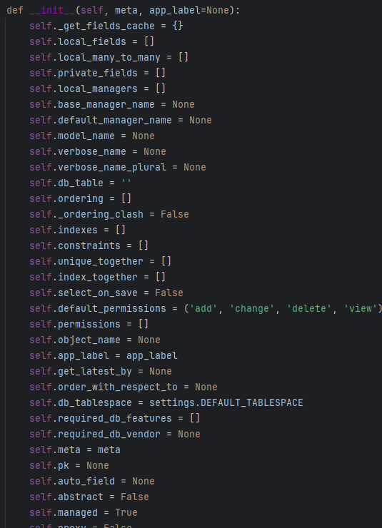

## orm实践操作  
注意本次app统一都暴露在根目录下,所以不需要去apps.py中修改name了！！  


## 多数据库
django支持链接多个数据库,可以像下面这样写  
```python
DATABASES = {
    'default': {
        'ENGINE': 'django.db.backends.mysql',
        'NAME': 'djangoorm',
        'HOST':'localhost',
        'PORT':3306,
        'USER':'root',
        'PASSWORD':'HHCzio20',
        'POOL_OPTIONS':{
            'POOL_SIZE':10, #最小数量
            'MAX_OVERFLOW':10, #在最小的基础上还可以增加多少个
            'RECYCLE':24*60*60, #连接可以被重复用多久,超过会重新创建,-1表示永久
            'TIMEOUT':30 #池中没有现成最多等待的时间
        }
    },
    'other_db1':{
        'ENGINE': 'django.db.backends.mysql',
        'NAME': 'djangoorm2',
        'HOST':'localhost',
        'PORT':3306,
        'USER':'root',
        'PASSWORD':'HHCzio20',
        'POOL_OPTIONS':{
            'POOL_SIZE':10, #最小数量
            'MAX_OVERFLOW':10, #在最小的基础上还可以增加多少个
            'RECYCLE':24*60*60, #连接可以被重复用多久,超过会重新创建,-1表示永久
            'TIMEOUT':30 #池中没有现成最多等待的时间
        }
    }
}
```

### orm读写分离    
这种情况下就要使用多个数据库   
譬如:  
> 192.168.150.138:3306 #用来做写操作  
> 192.168.150.139:3306 #用来做读操作     


进行migrate的时候我们经常会这样操作   
python manage.py migrate  
其实它本质上是做的  
python manage.py migrate --database=default   

所以我们还可以这么写  
python manage.py migrate --database=back 注意,这个案例里一定要做这一步,不然只有默认的表中有数据 

这样后续进行开发的时候在视图函数中我们可以这样写  
```python
from django.shortcuts import render

from .models import Userinfo
# Create your views here.

def index(request):
    #创建一条数据
    Userinfo.objects.using('default').create(name='zhangsan')
    #从back中读取数据
    res =Userinfo.objects.using('back').all()
    print(res)
```
>其中`using()`可以进行指定的数据库,如果不写那就是默认,如果写了那就按照指定的数据库来进行操作  
> 如果进行读写分离的话我们可以指定读取的数据库为other_db1  
> 如 models.Userinfo.objects.using('other_db1).all()   
> 

如果只是这样用using来做数据库的选择的话可能会比较烦  
所以!!! django支持一个router的类可以对上面的操作进行简化  
- 编写router类  
```python
class Router(object):
    def db_for_read(self, model, **hints):
        print('--------------------------------------------')
        print(model._meta.app_label) #tips:操作的是哪个app
        print(model._meta,type(model._meta)) #app01.userinfo <class 'django.db.models.options.Options'>
        print(model._meta.model_name) #tips:表名称
        print(hints)
        return 'back'

    def db_for_write(self,model,**hints):
        return 'default'


```
- model._meta.app_label 操作的是哪个app,返回的是app名称  
- model._meta.model_name 返回当前操作的表的名称   
基于此我们接下来的分库操作会有大用
如果想看看都有哪些参数可以进行查看的话，路径是`django.db.models.options.Options`    
  


- 然后还需要再settings.py中进行设置  
```python
DATABASE_ROUTERS=['utils.router.Router']
```

这样修改之后其实之前写的就不需要那么麻烦的写.using()了  
```python
from models import Uesrinfo
def index(request):
    #创建一条数据
    Userinfo.objects.create(name='zhangsan')
    #读取
    res =Userinfo.objects.all()
    print(res)

    return HttpResponse('ok')
```

这样相当于检测到读写的时候选择默认的路由,  
检测到读就走db_for_read指定的数据库  
检测到写就走db_for_write指定的数据库  


### 分库 - 根据app划分  
项目比较多的时候,比如项目中有100张表,如果只存在一个数据库中那对数据库的性能会造成影响  
现在的需求是将一部分数据存入到a数据库中,另一部分存到b数据库中  

例如apps下有app01和app02而且两个app都有各自的表  
但是所希望的不是将这两张表存在一个settings.py中指定的一个数据库中  
而是想让其存入不同的数据库中    

- 实例  
> 将app01中的表放入到default库中  
> 将app02中的表放入到back这个库中   


先初始化   
```commandline
python manage.py makemigrations
```

接下来这一步不同以往    
```commandline
python manage.py migrate app01 --database=default
```
这一步只针对app01进行表的生成,并指定存储的数据库为默认数据库而不是以往的写好model就所有都生成    

```commandline
python manage.py migrate app02 --database=back
```
这一步让app02的表生成在数据库back中  

最终的效果就是app01的表在数据库default中   
app02的表在数据库back中  

需要注意的是,如果进行了分库操作之后那么以后进行migrate的时候就得按照分库的migrate来了  
譬如对某个库进行了操作那就只动某个库的   
譬如对default库中的app01进行了表字段的修改   
那么就得  
```commandline
python manage.py migrate app01 --database=default
```

#### 读写操作   
注意,这个分库操作中没用上router,所以记得在settings.py中将其注释掉  
```python
# DATABASE_ROUTERS=['utils.router.Router']
```

在app01的views.py中这样写
因为默认的情况下会用default库来进行操作,所以对于在default库中的app01的表我们可以不用写using  
但是对于在back数据库中的app02中的表我们需要使用using()来进行数据库的指定,否则就会产生报错   
接下来我们要指定好数据库操作,因为默认的话使

```python
def index(request):

    #tips:操作app01中的models中的表
    #创建一条数据
    m1.Userinfo.objects.create(name='lisi')
    #读取
    res =m1.Userinfo.objects.all()
    print(res)

    #tips:操作app02中的models中的表
    #创建一条数据
    m2.Role.objects.using('back').create(role_name='nikofox')
    res = m2.Role.objects.using('back').all()
    print(res)

    return HttpResponse('ok')

```

- 那么我们还能用router么？？   
答案是肯定的,不过需要进行下面的改动   
记得既然要使用router就先把设置中的router给打开  
```python
DATABASE_ROUTERS=['utils.router.Router']
```
之前做的读写分离是将读写分开进行操作了,这次不是  
回想之前的几个操作

```python
print(model._meta.app_label)  # tips:操作的是哪个app
print(model._meta, type(model._meta))  # app01.userinfo <class 'django.db.models.options.Options'>
print(model._meta.model_name)  # tips:表名称
print(hints)
```
- model._meta.app_label可以知道操作的是哪个app,  那么我们就可以用其来做判断来进行判断   
```python
    def db_for_read(self, model, **hints):
        if model._meta.app_label == 'app01':
            return 'default'
        elif model._meta.app_label == 'app02':
            return 'back'
    def db_for_write(self, model, **hints):
        if model._meta.app_label == 'app01':
            return 'default'
        elif model._meta.app_label == 'app02':
            return 'back'
```
这样就可以让其自动判断是哪个app然后按照不同的app指定返回不同的数据库标   
这样的话我们就不用写using了
```python
def index(request):

    #tips:操作app01中的models中的表
    #创建一条数据
    m1.Userinfo.objects.create(name='lisi')
    #读取
    res =m1.Userinfo.objects.all()
    print(res)

    #tips:操作app02中的models中的表
    #创建一条数据
    m2.Role.objects.create(role_name='nikofox')
    res = m2.Role.objects.all()
    print(res)

    return HttpResponse('ok')

```


### 注意事项  
- 分库的时候，希望表拆分到不同的数据库   
> 这时候就要注意，不要跨数据库做关联  -> 因为django不支持这么做  

- 读写分离的功能在有大量用户的时候是需要的,但是对于中小型项目，访问量小的时候是不需要分库的，也不需要读写分离   
- 但是如果项目访问量大，读写分离和分库就是有必要的了   


